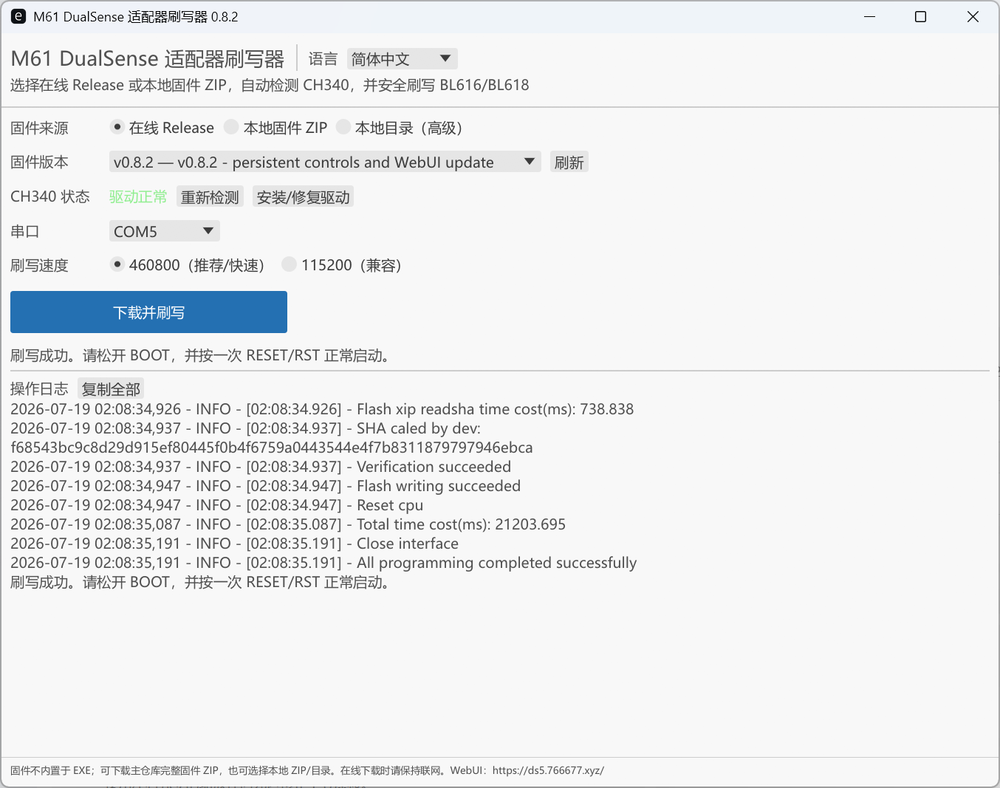
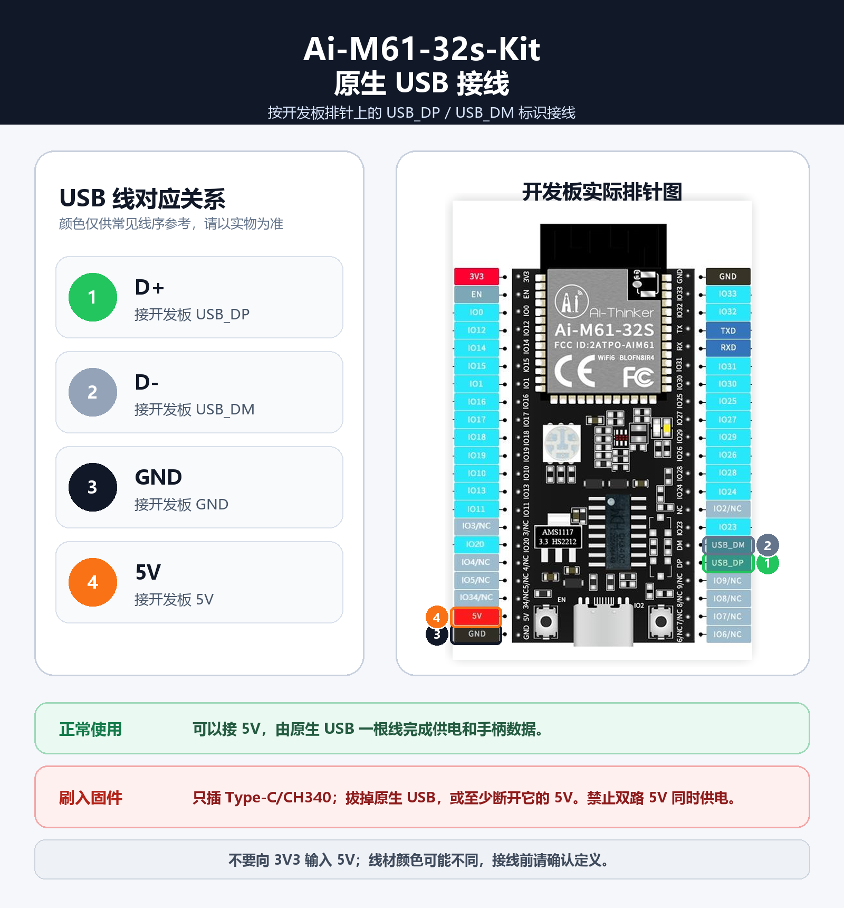
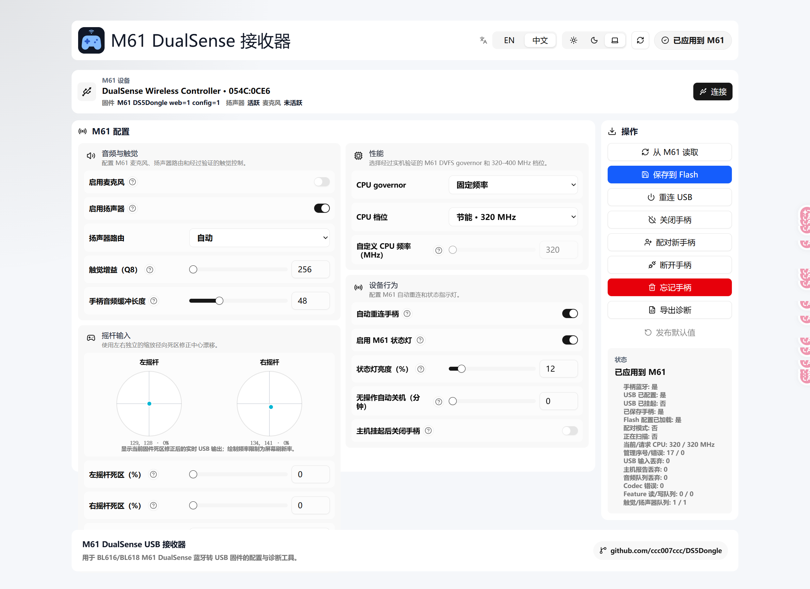

# Ai-M61-32s-Kit quick start

[简体中文](QUICK_START.zh-CN.md)

This guide is for Windows users flashing a prebuilt Release. Python, Rust, the
SDK, and a compiler are not required.

## What you need

- an Ai-M61-32s-Kit board;
- a Type-C data cable for CH340 flashing;
- a USB-A plug to four Dupont leads for native USB during normal use;
- a standard DualSense controller;
- Windows 10/11 and Chrome or Edge.

DualSense Edge is not hardware-tested. The firmware has no 1000 Hz mode; its
stable choices are fixed 250 Hz, fixed 500 Hz, and realtime forwarding. The
microphone is disabled by default because enabling it adds substantial
realtime load.

## 1. Download the flasher

Download the latest `M61-Flasher-Windows.exe` from Releases:

<https://github.com/ccc007ccc/DS5Dongle/releases/latest>

The flasher lists complete firmware versions, checks the CH340 port, and can
offer the official WCH driver when it is genuinely missing.

## 2. Flash the firmware

Connect only Type-C/CH340 while flashing. Do not leave native USB plugged in.

1. Hold the board's BOOT button.
2. Tap and release RESET/RST.
3. Release BOOT.
4. Open the flasher and select an online Release or a complete local firmware
   ZIP.
5. Select the Ai-M61-32s-Kit CH340 port and keep the recommended 460800 speed.
6. Choose Download and flash, then wait for verification and writing to pass.
7. Unplug Type-C after flashing succeeds.

Use the 115200 compatibility speed only if an unstable cable or hub causes the
normal 460800 path to fail.

## 3. Wire native USB

During normal use, one native USB cable supplies both power and controller
data:

- USB D+ to board `USB_DP`;
- USB D- to board `USB_DM`;
- USB ground to board `GND`;
- USB 5 V to board `5V`.

Never feed 5 V into `3V3`. Wire colours are not guaranteed; verify the cable's
D+, D-, 5 V, and ground assignments first.

Plug native USB into the PC. Windows should enumerate a DualSense composite
device, game controller, and audio devices—not only a CH340 serial port.

## 4. Connect the controller

For first pairing or a replacement controller:

1. Hold Create+PS until the controller light bar flashes quickly.
2. Plug in native USB or tap the board's RESET button.
3. Wait for the board status LED to become solid blue.

A saved controller reconnects automatically; press PS once if it is asleep.
The WebUI also provides Pair new controller, Disconnect, and Forget actions.

## 5. Configure from the WebUI

Open this URL in Chrome or Edge:

<https://ds5.766677.xyz/>

1. Choose Connect and select the DualSense device exposed by the
   Ai-M61-32s-Kit.
2. Choose Read from M61.
3. Change only the required settings.
4. Choose Save to Flash, otherwise changes will not survive power loss.

Start with the release defaults: 320 MHz, microphone off, no overclock, 0%
stick deadzones, and audio-buffer hint 48.

## Troubleshooting

### The flasher cannot find a serial port

- Confirm the board Type-C/CH340 connector is in use.
- Repeat the BOOT+RESET ISP sequence.
- Recheck the CH340 driver and port from the flasher.

### Windows shows only a COM port

The COM port belongs to CH340. Controller data requires the separate
`USB_DP`, `USB_DM`, `GND`, and `5V` native-USB connection.

### Native USB shows no device

- Check whether D+ and D- are reversed.
- Confirm the USB cable actually contains data conductors.
- Confirm 5 V goes to board `5V`, not `3V3`.
- Power down, correct the wiring, and tap RESET after reconnecting.

### Avoiding dual-source power while flashing

The simplest method is to unplug native USB and connect only Type-C/CH340. If
native USB data must remain connected, disconnect at least its 5 V conductor.

See [Hardware and wiring](HARDWARE.md) and
[Building and flashing](BUILDING.md) for the complete hardware, power, and
developer-diagnostics documentation.
